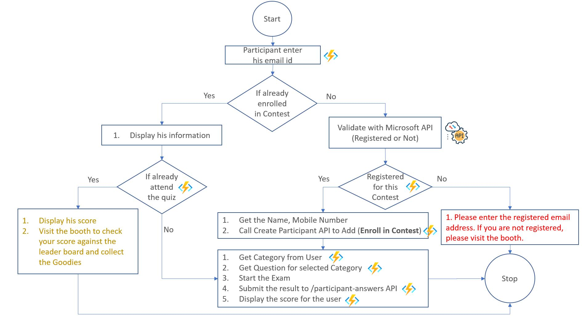
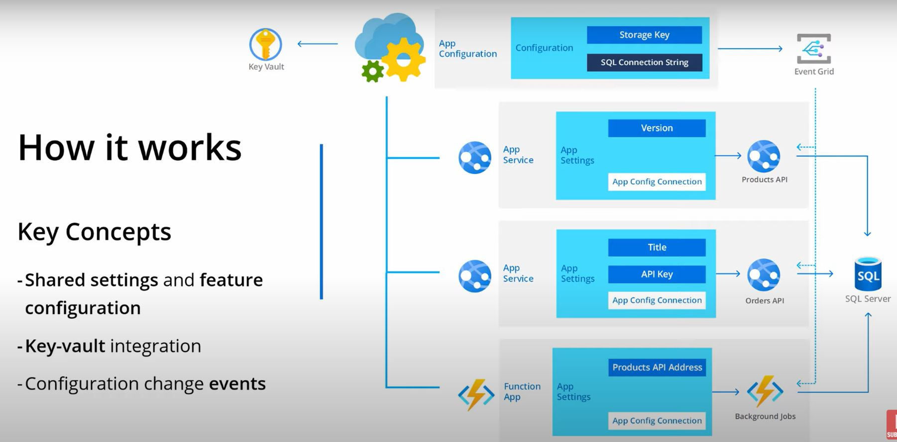

# Azure Serverless
This is sample project developed in Azure Function v4 with dotnet 6. This repo is integrated with [Cloud Sonarqube](https://sonarcloud.io/summary/new_code?id=natarajanganapathi_AzureServerless) to validate the code quality and security check. 

## Workflow 

## App Configuration

## Reference

1. [Azure Function Ref.](https://github.com/MicrosoftDocs/azure-docs/blob/main/articles/azure-functions/create-first-function-cli-csharp.md)

## Following actions are considered when the development

### V.1.0

1. Azure Key Vault - Done
2. AppInsights Configuration - Done 
3. Following .Net 6 standards - Done
4. Following Azure Standards when create the azure resource in Cloud
5. Configure C# Lint in VSCode - Done
6. Configure Sonar Lint in VSCode - Done
7. Sonarqube Integration (Quality, Security) - Done
8. GitHub Actions (Trunk based) - Done
9. Sequence Diagram Documentation
10. Dependency Diagram documentation

### V.2.0

1. Event Driven / Async Function call
2. Durable Function
3. Azure App Configuration integration
4. Azure App Service Deployment using GitHub Actions
5. Send Email after complete the Test (using Service Bus)

### Verificatoin:

1.  ASK, Container APPs, Container Ins, Azure Fun, App Service
